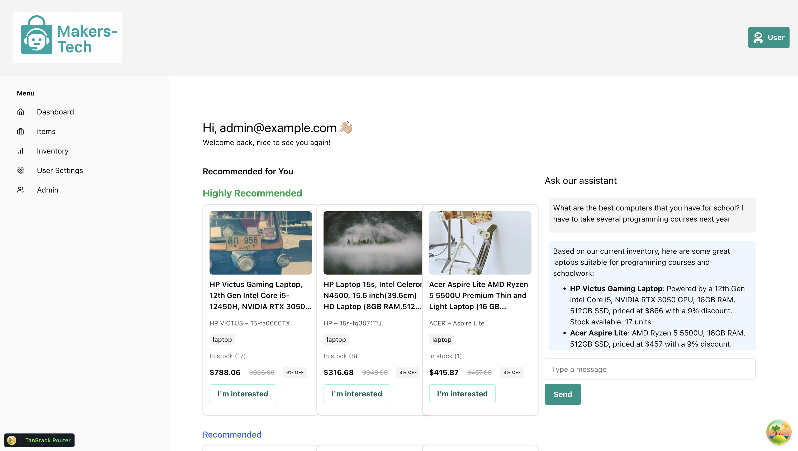
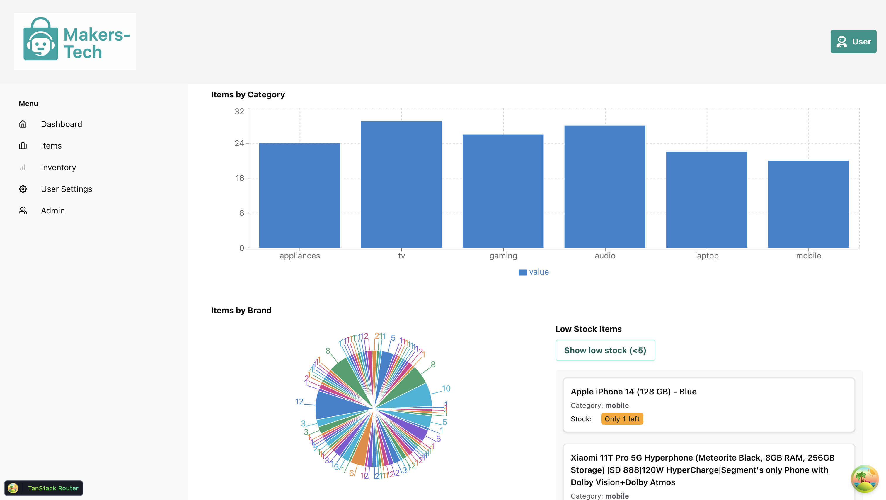

# MakersTech AI Commerce Assistant 🛍️🤖

A conversational product assistant and personalized recommender system, built on top of the [FastAPI full-stack template](https://github.com/tiangolo/full-stack-fastapi-template).

This project adds intelligent and interactive capabilities to a tech e-commerce backend, enabling real-time inventory querying via chat, AI-powered product recommendations, and stock insights for admins — all within a production-ready FastAPI + React + PostgreSQL stack.

---

## 🚀 Features

### 🧠 AI ChatBot (LLM-powered)
- Natural language interface for customers to explore the **real-time product inventory**.
- Personalized responses generated by GPT (via OpenAI), using a **LangChain Agent** with tool access to the database.
- Supports contextual follow-up questions (via chat history).
- The model is strictly instructed to **only answer based on inventory**, avoiding hallucinated brands or products.
- Handles edge cases (e.g. "Do you sell bikes?") gracefully.

### 🎯 Intelligent Recommendation System
- Every user has counters tracking interaction by product category.
- These counters feed a **probabilistic recommender**, classifying products into:
  - **Highly Recommended**
  - **Recommended**
  - **Not Recommended**
- Recommendations are shown side-by-side with the chatbot in the user dashboard.

### 📊 Admin Inventory Dashboard
- Graphs for stock distribution by **category** (bar chart) and **brand** (pie chart).
- Real-time list of **low stock items**, with filters (e.g., "critical only").
- Scrollable UI cards showing product title, category, and badges for critical stock levels.
- All built using Chakra UI and Recharts.

---

## 🧱 Architecture

- **Backend**: FastAPI + SQLModel + PostgreSQL + Alembic
- **LLM Integration**: LangChain Agent (Conversational React) with tool for DB access
- **Frontend**: React (Chakra UI), React Query, TanStack Router
- **Database Models**: Extended from the template to support products, users with interaction tracking, and chat history
- **Authentication**: OAuth-ready (provided by template)
- **CI/CD**: Preconfigured via the upstream template

---

## ⚙️ Setup

This project is built on the [FastAPI Full-Stack Template](https://github.com/tiangolo/full-stack-fastapi-template). Please follow their instructions for installation and deployment.

### Minimal Requirements
- `OPENAI_API_KEY` in your `.env`
- Then run:
```bash
docker compose up
```

---

## 🧪 Try It Out

- Sign up as a user and go to the dashboard
- Use the chat box to ask:
  - _"What laptops do you have in stock?"_
  - _"Which one is better for gaming?"_
  - _"Do you sell TVs?"_
- Go to the **Admin Panel > Inventory** to see stock metrics and low-stock alerts
- Ask the chatbot about products — and get answers driven by **your own inventory**

---

## 📎 What's Unique?

✅ Inventory-aware LLM  
✅ Real product data used in conversation  
✅ Personalized recommendations with interaction history  
✅ Analytics built-in for stock management  
✅ Based on a stable, scalable full-stack template

---

## 🧑‍💻 Authors & Contributions

This project was extended and customized with:
- Custom product models, DTOs, and migrations
- OpenAI agent integration via LangChain
- Recommender system using user interaction logs
- Advanced frontend components (Chatbot, Product Cards, Charts)

---

## 📌 License & Credits

MIT. Built using:

- [FastAPI Full-Stack Template](https://github.com/tiangolo/full-stack-fastapi-template)
- [LangChain](https://github.com/langchain-ai/langchain)
- [Chakra UI](https://chakra-ui.com)
- [OpenAI](https://platform.openai.com)

---

## Gallery



